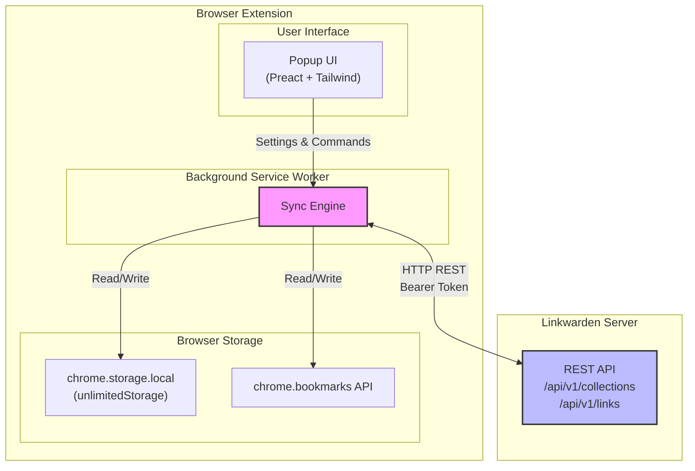
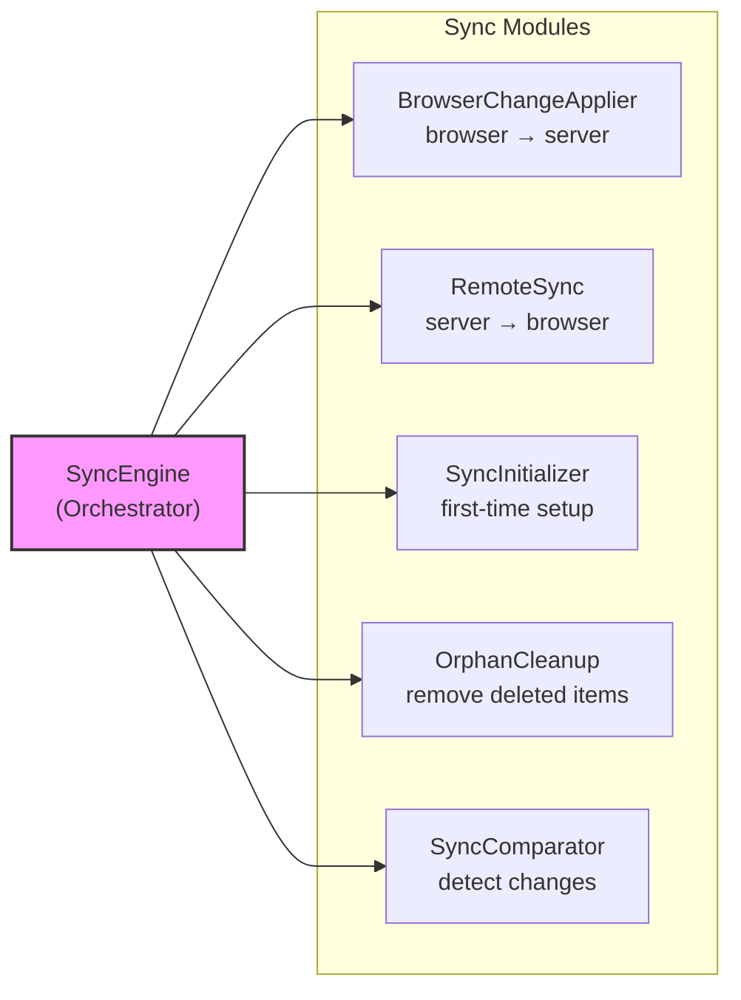
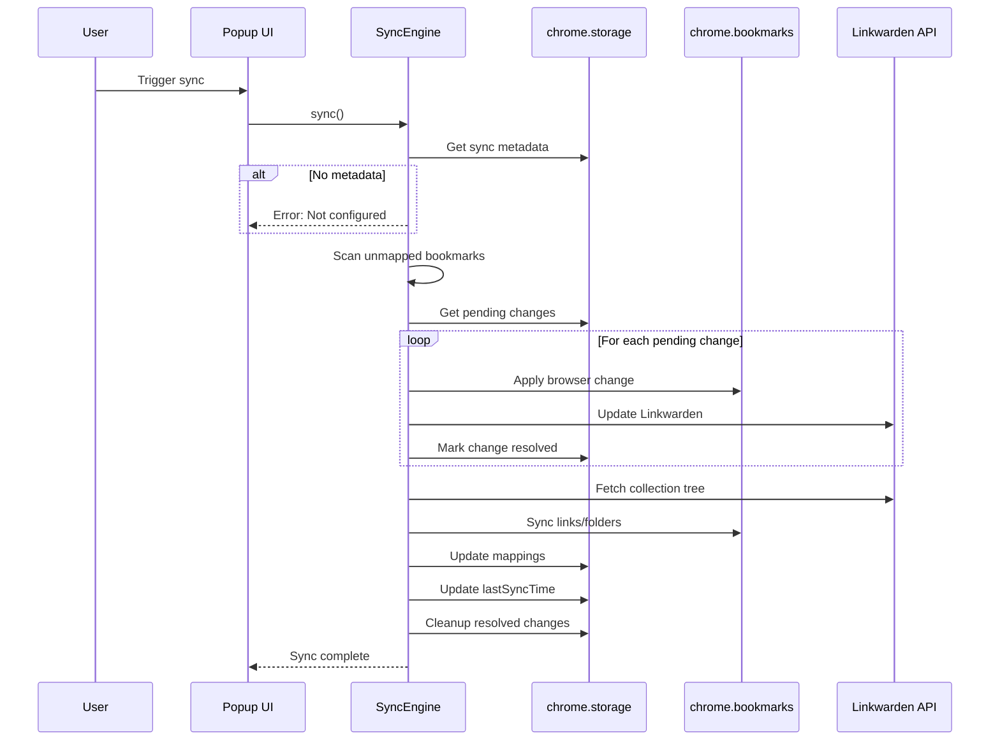
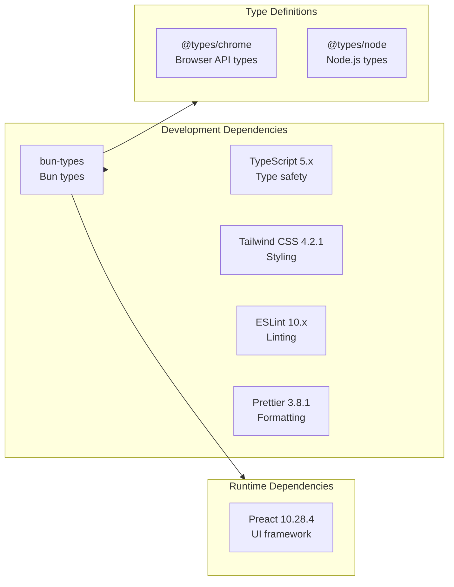
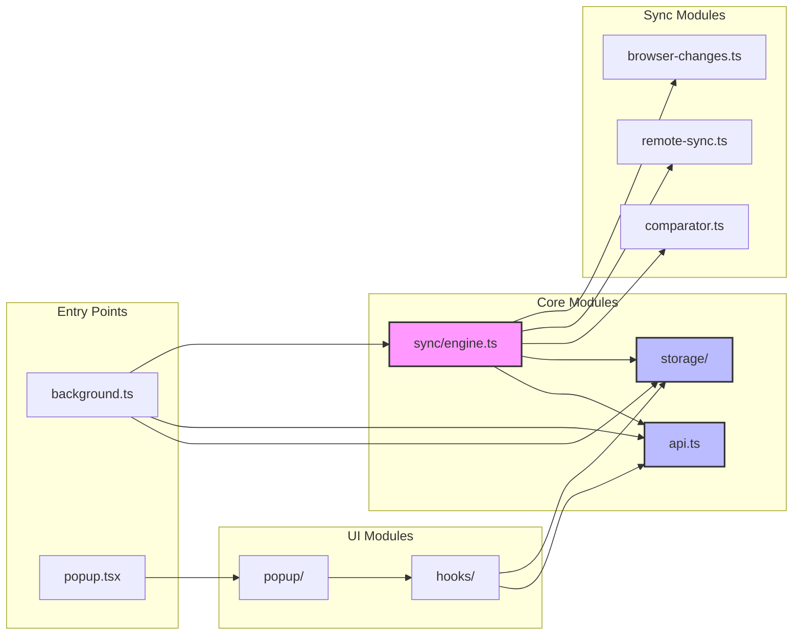

# Linkwarden Browser Extension - Design Document

**Status:** ✅ Core Implementation Complete

A browser extension that bidirectionally syncs a Linkwarden collection (and subcollections) with browser bookmarks. Supports Chrome, Firefox, and Edge with Manifest V3.

---

## 1. Overview

**Implementation Status:** Complete and tested (134 tests passing)

| Component | Status |
|-----------|--------|
| One-way sync (Linkwarden → Browser) | ✅ Complete |
| Bidirectional sync | ✅ Complete |
| Conflict resolution (LWW + checksums) | ✅ Complete |
| Subcollection support | ✅ Complete |
| Folder moves (bidirectional) | ✅ Complete |
| Path-based duplicate handling | ✅ Complete |
| Deterministic builds | ✅ Complete |
| Cross-browser support (MV3) | ✅ Complete |
| **Bookmark order preservation** | ✅ Complete |
| **Optimized fetch with retry logic** | ✅ Complete |

### Linkwarden API
- **Base URL**: `{instance}/api/v1`
- **Auth**: Bearer token (JWT from Settings → Access Tokens)
- **Endpoints**: `GET/POST /collections`, `GET/POST/DELETE /links`, `GET /search`
- **Collection Tree**: `GET /collections/:id` with nested subcollections

### Browser Bookmarks API
- **Supported**: Chrome (MV3), Firefox (MV3 128+), Edge (MV3)
- **Structure**: Tree via `BookmarkTreeNode` (`id`, `parentId`, `title`, `url`, `children`)
- **Events**: `onCreated`, `onRemoved`, `onChanged`, `onMoved`
- **Permission**: `"bookmarks"` required in manifest

---

## 2. Architecture

### 2.1 System Overview



### 2.2 Sync Engine Modules



**Storage:** `chrome.storage.local` with `unlimitedStorage` permission (no quota limits)

---

## 3. Conflict Resolution

**Strategy:** Last-Write-Wins with Checksum Validation

### 3.1 Conflict Resolution Flow

```mermaid
flowchart TD
    Start["Conflict Detected"]
    ComputeChecksum["Compute remote checksum"]
    CompareChecksums{"Checksums<br/>match?"}
    NoOp["no-op<br/>No action needed"]
    
    CompareTimestamps{"Remote timestamp<br/>> Browser timestamp?"}
    UseRemote["use-remote<br/>Linkwarden wins"]
    UseLocalNewer{"Browser timestamp<br/>> Remote timestamp?"}
    UseLocal["use-local<br/>Browser wins"]
    UseLocalTie["use-local<br/>Tie: Browser wins"]
    
    Start --> ComputeChecksum
    ComputeChecksum --> CompareChecksums
    CompareChecksums -->|Yes| NoOp
    CompareChecksums -->|No| CompareTimestamps
    CompareTimestamps -->|Yes| UseRemote
    CompareTimestamps -->|No| UseLocalNewer
    UseLocalNewer -->|Yes| UseLocal
    UseLocalNewer -->|No (Tie)| UseLocalTie
    
    style NoOp fill:#9f9,stroke:#333
    style UseRemote fill:#ff9,stroke:#333
    style UseLocal fill:#ff9,stroke:#333
    style UseLocalTie fill:#ff9,stroke:#333
```

### 3.2 Implementation

```typescript
function resolveConflict(
  local: Mapping,
  remote: { name?: string; url?: string; updatedAt: string }
): ConflictResult {
  const remoteUpdatedAt = new Date(remote.updatedAt).getTime();

  // 1. If checksums match, no conflict
  const remoteChecksum = computeChecksum(remote);
  if (local.checksum === remoteChecksum) {
    return "no-op";
  }

  // 2. Last-write-wins based on updatedAt timestamp
  if (remoteUpdatedAt > local.browserUpdatedAt) {
    return "use-remote"; // Linkwarden wins
  } else if (local.browserUpdatedAt > remoteUpdatedAt) {
    return "use-local"; // Browser wins
  }

  // 3. Exact timestamp tie: prefer browser (user's immediate action)
  return "use-local";
}
```

**Rationale:** Simple, debuggable, no dependencies. Checksum prevents unnecessary syncs; timestamps from Linkwarden are reliable; browser wins on ties (user's immediate action).

---

## 4. Sync Algorithm

### 4.1 Sync Flow



### 4.2 Initial Sync

1. Fetch target collection + subcollections recursively
2. Create matching browser folder structure
3. Populate `mappings` table
4. Record `lastSyncTime`

### 4.3 Incremental Sync

1. **Detect** - Query Linkwarden + browser, compare via checksums/timestamps
2. **Resolve** - Apply LWW strategy, queue actions
3. **Apply** - Deletions (bottom-up) → Creations (top-down) → Updates
4. **Update** - Refresh mappings table

### 4.4 Change Detection

| Direction | Mechanism |
|-----------|-----------|
| **Browser → Linkwarden** | Listen to `chrome.bookmarks.onCreated/Changed/Removed/Moved` events |
| **Linkwarden → Browser** | Poll on interval (default 5 min), compare `updatedAt` timestamps |

### 4.5 Sync Statistics

The `SyncStats` class tracks sync operations:

```typescript
interface SyncStatsObject {
  created: number;   // Items created
  updated: number;   // Items updated
  deleted: number;   // Items deleted
  skipped: number;   // Items skipped (no changes)
}
```

---

## 5. Technical Stack

| Component | Technology | Version |
|-----------|------------|---------|
| **Extension** | Manifest V3 | Chrome, Firefox 128+, Edge |
| **Language** | TypeScript | 5.x |
| **Runtime** | Bun | 1.3.9 |
| **Storage** | chrome.storage.local | unlimitedStorage permission |
| **UI Framework** | Preact | 10.28.4 |
| **Styling** | Tailwind CSS v4 | 4.2.1 |
| **Bundler** | Bun build | Native |
| **Test Runner** | Bun test | bun:test |
| **Linting** | ESLint | 10.x |
| **Formatting** | Prettier | 3.8.1 |

### 5.1 Dependencies



---

## 6. Project Structure

```
lwsync/
├── package.json           # Scripts: build, dev, zip, verify, test
├── bunfig.toml            # Bun build config
├── tsconfig.json          # TypeScript config
├── Containerfile          # Reproducible build container
├── env.example            # Environment variables template
├── DESIGN.md              # This document
├── README.md              # User documentation
├── AGENTS.md              # Quick reference
├── assets/
│   ├── manifest.json      # Chrome MV3 manifest
│   ├── manifest.firefox.json  # Firefox MV3 manifest
│   ├── popup.html         # Settings UI entry point
│   ├── icon*.png          # Extension icons (16, 48, 128)
│   └── styles.css         # Tailwind CSS entry point
├── scripts/
│   ├── build.ts           # Fast local build
│   ├── build-prod.ts      # Containerized reproducible build
│   ├── zip.ts             # Package with checksums
│   └── watch.ts           # Dev watch mode with hot-reload
├── src/
│   ├── background.ts      # Service worker (MV3)
│   ├── darkmode.ts        # Dark mode content script
│   ├── popup.tsx          # Popup UI (Preact)
│   ├── api.ts             # Linkwarden API client
│   ├── bookmarks.ts       # Bookmarks API wrapper
│   ├── browser.ts         # Browser detection utilities
│   ├── config.ts          # Centralized configuration
│   ├── storage/           # Storage wrapper module
│   │   ├── index.ts       # Barrel exports
│   │   ├── main.ts        # Core storage operations
│   │   ├── batch.ts       # Batch operations
│   │   └── transaction.ts # Transaction support
│   ├── sync/              # Sync engine modules
│   │   ├── index.ts       # Barrel exports
│   │   ├── engine.ts      # Main SyncEngine orchestrator
│   │   ├── browser-changes.ts  # Browser → Server sync
│   │   ├── remote-sync.ts      # Server → Browser sync
│   │   ├── initialization.ts   # First-time sync setup
│   │   ├── orphans.ts          # Cleanup deleted items
│   │   ├── comparator.ts       # Change detection
│   │   ├── collections.ts      # Collection sync
│   │   ├── links.ts            # Link sync
│   │   ├── mappings.ts         # Mapping operations
│   │   ├── moves.ts            # Folder move handling
│   │   ├── conflict.ts         # Conflict resolution
│   │   └── errorReporter.ts    # Error collection
│   ├── popup/             # Popup UI modules
│   │   ├── components/    # Feature components
│   │   ├── sections/      # Page sections
│   │   ├── hooks/         # Custom Preact hooks
│   │   ├── ui/            # Reusable UI primitives
│   │   └── styles.css     # Tailwind CSS v4 entry
│   ├── types/             # TypeScript type definitions
│   ├── utils/             # Utility functions
│   └── logger.ts          # Logging utilities
├── tests/
│   ├── fixtures/          # Test data factories
│   ├── mocks/             # Mock implementations
│   ├── builders/          # Test data builders
│   ├── utils/             # Test utilities
│   ├── sync.test.ts       # Unit tests (pure functions, 28 tests)
│   ├── storage.test.ts    # Storage unit tests (21 tests)
│   ├── api.e2e.test.ts    # API E2E tests (8 tests)
│   └── sync.integration.test.ts  # Integration tests (62 tests)
└── dist/
    ├── chrome/            # Chrome/Edge build output
    └── firefox/           # Firefox build output
```

### 6.1 Source Code Module Dependencies



---

## 7. Implementation Status

| Phase | Feature | Status | Tests |
|-------|---------|--------|-------|
| **Phase 1** | Foundation (manifest, storage, API client, settings UI) | ✅ Complete | - |
| **Phase 2** | One-way sync (Linkwarden → Browser) | ✅ Complete | - |
| **Phase 3** | Bidirectional sync + conflict resolution | ✅ Complete | 28 unit + 62 integration |
| **Phase 4** | Polish (error handling, logging, deduplication, path-based matching) | ✅ Complete | - |
| **Phase 5** | Build infrastructure (deterministic builds, checksums) | ✅ Complete | - |
| **Phase 6** | Firefox MV3 migration | ✅ Complete | - |
| **Phase 7** | UI refactoring + Tailwind CSS v4 migration | ✅ Complete | - |
| **Phase 8** | Test suite consolidation | ✅ Complete | 119 total |
| **Phase 9** | Bookmark order preservation (client-side) | ✅ Complete | 13 order tests |
| **Phase 10** | Optimized fetch + API compliance | ✅ Complete | 134 total |
| **Phase 11** | Server-side order tokens (item-level) | 🔄 In Progress | 276 total (core infrastructure complete) |

---

## 8. Key Design Decisions

| # | Decision | Rationale |
|---|----------|-----------|
| 1 | `chrome.storage.local` + `unlimitedStorage` | Simpler than IndexedDB; no quota limits |
| 2 | TDD for core logic | `bun test` for sync engine, conflict resolution |
| 3 | Polling over Webhooks | Linkwarden lacks WebSocket API; polling is reliable |
| 4 | Folder-per-Collection | Maps collections to folders; tags not synced |
| 5 | No content archival | Sync URLs/titles only, not archived content |
| 6 | Single root folder | User selects one collection; subcollections included |
| 7 | Bun for bundling | Fast builds, simple config, no dependencies |
| 8 | Mapping table = source of truth | Never search by name after first sync |
| 9 | Deduplication before creation | Check server/browser before creating |
| 10 | Graceful 409 handling | 409 = expected, create mapping and continue |
| 11 | Tailwind CSS v4 for styling | Utility-first CSS, minimal custom styles, fast builds |
| 12 | Modular UI components | Refactored monolithic popup into reusable components |
| 13 | Modular sync engine | Separation of concerns: browser-changes, remote-sync, comparator, etc. |
| 14 | Centralized configuration | Single source of truth for all magic numbers |
| 15 | Error reporter pattern | Collect and report errors without failing entire sync |
| 16 | Consolidated test suite | 134 tests, no duplicates, comprehensive coverage |
| 17 | **Local order storage (`browserIndex`)** | Preserve bookmark order without server-side hacks |
| 18 | **Only documented APIs** | Use supported endpoints, avoid undocumented features |
| 19 | **Retry logic for `/search`** | Handle eventual consistency in search index |
| 20 | **Item-level order tokens** | Store order in each item's description field for cross-device sync |
| 21 | **Order uniqueness constraint** | Enforce unique `browserIndex` per item type (no duplicates) |
| 22 | **Batch API operations** | Parallel execution for efficiency (10x faster than sequential) |

---

## 10. Storage Schema

### 10.1 Data Structure

```mermaid
erDiagram
    SyncMetadata {
        string id
        number lastSyncTime
        string syncDirection
        number targetCollectionId
        string browserRootFolderId
    }
    
    Mapping {
        string id
        string linkwardenType
        number linkwardenId
        string browserId
        number linkwardenUpdatedAt
        number browserUpdatedAt
        number lastSyncedAt
        string checksum
        number browserIndex  // Optional: position in parent folder
    }
    
    PendingChange {
        string id
        string type
        string source
        number linkwardenId
        string browserId
        number parentId
        object data
        number timestamp
        boolean resolved
    }
    
    Settings {
        string serverUrl
        string accessToken
        number syncInterval
        number targetCollectionId
        string targetCollectionName
        string browserFolderName
    }
    
    LogEntry {
        number timestamp
        string type
        string message
    }
    
    SectionState {
        string sectionId
        boolean isExpanded
    }
    
    SyncMetadata ||--o{ Mapping : "tracks"
    SyncMetadata ||--o{ PendingChange : "queues"
    Settings ||--o| SyncMetadata : "configures"
```

### 10.2 Storage Keys

| Key | Type | Description |
|-----|------|-------------|
| `sync_metadata` | `SyncMetadata \| null` | Last sync time, sync direction, target IDs |
| `mappings` | `Mapping[]` | Linkwarden ↔ Browser ID mappings |
| `pending_changes` | `PendingChange[]` | Queue of changes to process |
| `settings` | `Settings \| null` | User configuration |
| `sync_log` | `LogEntry[]` | Recent sync activity (max 100 entries) |
| `section_state` | `SectionState` | UI collapse/expand state |

### 10.3 Mapping Types

```typescript
type LinkwardenType = "link" | "collection";

interface Mapping {
  id: string;                    // Unique mapping ID
  linkwardenType: LinkwardenType; // "link" or "collection"
  linkwardenId: number;          // Linkwarden item ID
  browserId: string;             // Browser bookmark/folder ID
  linkwardenUpdatedAt: number;   // Timestamp from Linkwarden
  browserUpdatedAt: number;      // Timestamp from browser
  lastSyncedAt: number;          // Last successful sync time
  checksum: string;              // SHA-256 of name + url
  browserIndex?: number;         // Optional: Track position in parent folder (order preservation)
  // Server-side order token support (Phase 11+)
  cachedName?: string;           // Cached item name for hash regeneration on rename
  cachedNameHash?: string;       // Hash of cachedName (first 4 + last 4 of MD5-style hash)
}
```

## 11. Duplicate Handling

| Tier | Strategy | Use Case |
|------|----------|----------|
| 1 | **Mapping Table** (primary) | O(1) lookup via `getMappingByLinkwardenId()` |
| 2 | **Name Matching** (fallback) | Check existing folder by name under known parent |
| 3 | **Path-Based Matching** (recovery) | Build path `/Parent/Child/Grandchild` if mappings lost |

**Not Done:**
- ❌ Append IDs to names (ugly: `Resources [12345]`)
- ❌ Index-based matching (fragile)
- ❌ Skip duplicates (data loss)

**Recovery:** `recoverMappings()` scans collections and rebuilds mappings from hierarchy.

---

## 11.5. Server-Side Order Tokens (Phase 11)

**Status:** 🔄 Core Infrastructure Complete (276 tests passing)

### Token Format

Each link/collection stores its **own position** in its description field:

```
[LW:O:{"47b2f5fa":"3"}]
 ↑      ↑        ↑
Prefix Hash    Index (position in parent)
```

**Components:**
| Part | Format | Example |
|------|--------|---------|
| Prefix | `[LW:O:` | Identifies as order token |
| Hash | 8 hex chars (first 4 + last 4 of hash) | `"47b2f5fa"` |
| Index | Position in parent (0-based integer) | `"3"` |
| Suffix | `}]` | Closes token |

**Full Description Example:**
```
My favorite bookmark [LW:O:{"47b2f5fa":"3"}]
↑                    ↑
User content         Token (preserved)
```

### Hash Generation

```typescript
function generateOrderHash(name: string): string {
  const hash = computeMD5(name); // 32-char DJB2-based hash
  return hash.substring(0, 4) + hash.substring(hash.length - 4);
}

// Example
generateOrderHash("My Bookmark"); // → "47b2f5fa"
```

**Why hash?**
- Detects renames automatically (hash changes when name changes)
- Prevents token tampering
- Compact (8 chars vs full name)

### Key Invariant: Uniqueness Constraint

**Each item must have a unique `browserIndex` within its type.** No two links can share the same `browserIndex`, no two collections can share the same `browserIndex`.

**Validation Utilities:**
- `validateOrderUniqueness()` - Detect conflicts
- `normalizeOrderIndices()` - Make indices sequential (0,1,2...)
- `fixOrderConflicts()` - Resolve conflicts automatically
- `isIndexAvailable()` - Check if index is free
- `shiftIndicesForInsert()` - Make room for new item
- `compactIndices()` - Remove gaps after deletion

### Sync Flow

**Server → Browser:**
1. Fetch links from server (with description field)
2. Parse order token: `getToken(link.description, link.name)`
3. Update mapping with `browserIndex`, `cachedName`, `cachedNameHash`
4. `restoreOrder()` uses stored `browserIndex` to reorder browser

**Browser → Server (Reorder):**
1. User drags bookmark → `onMoved` event fires
2. `handleMove()` detects reorder (same parent)
3. Update `mapping.browserIndex = newIndex`
4. Call `api.updateLinkOrder(id, cachedName, newIndex)`
5. Server updates link description with new token

**Rename Handling:**
1. User renames bookmark → `onChanged` event fires
2. Update `cachedName` and regenerate `cachedNameHash`
3. Next sync uses new hash for order token

### Conflict Resolution

**Strategy:** Last-Write-Wins (LWW) with timestamp comparison

```typescript
interface OrderConflict {
  browserOrder: number;
  serverOrder: number;
  browserModifiedAt: number; // bookmark.dateGroupModified
  serverModifiedAt: number;  // link.updatedAt
  winner: "browser" | "server";
}

// LWW based on timestamps
if (browserModifiedAt > serverModifiedAt) {
  winner = "browser"; // User reorder wins
} else if (serverModifiedAt > browserModifiedAt) {
  winner = "server"; // Other device wins
} else {
  winner = "browser"; // Tie - browser wins
}
```

### Batch Operations

**Client-side batch using `Promise.allSettled()`:**
```typescript
async batchUpdateLinks(updates: LinkUpdate[]): Promise<BatchResult> {
  const results = await Promise.allSettled(
    updates.map(({ id, data }) => this.updateLink(id, data))
  );
  
  // Track successes and failures
  return results.map((result, idx) => ({
    id: updates[idx].id,
    success: result.status === "fulfilled",
    error: result.status === "rejected" ? result.reason : undefined
  }));
}
```

**Performance:**
- Sequential (100 links): ~10 seconds
- Parallel (our approach): ~1 second
- True bulk API (if available): ~500ms (future optimization)

### Files

| File | Purpose |
|------|---------|
| `src/sync/item-order-token.ts` | Token parsing/formatting utilities |
| `src/sync/order-conflict.ts` | LWW conflict resolution |
| `src/sync/order-validation.ts` | Uniqueness validation and normalization |
| `src/api.ts` | Batch operations (`batchUpdateLinks`, `updateLinkOrders`) |
| `src/types/storage.ts` | Extended with `cachedName`/`cachedNameHash` |

### Test Coverage

| Test File | Tests | Purpose |
|-----------|-------|---------|
| `tests/item-order-token.test.ts` | 32 | Token parsing/formatting |
| `tests/order-conflict.test.ts` | 18 | Conflict resolution |
| `tests/order-validation.test.ts` | 20 | Uniqueness validation |
| `tests/api-extensions.test.ts` | 13 | Batch operations |
| `tests/migration.test.ts` | 13 | Schema migration |

**Total:** 276 tests passing (100%)

---

## 12. Risks & Mitigations

| Risk | Mitigation |
|------|------------|
| Clock skew between browser/server | Use server timestamps as source of truth; add 1-second tolerance |
| Large collections cause timeout | Paginate Linkwarden requests; batch bookmark operations |
| Circular moves in browser | Track move chains; detect loops via `isDescendantOf()` traversal |
| Token expiration | Handle 401 responses; prompt user to refresh token |
| Firefox MV3 compatibility | Firefox 128+ supports MV3; uses `background.scripts` instead of `service_worker` |
| Duplicate collection names | Mapping-first strategy; path-based fallback |
| Lost mappings (data corruption) | Recovery utility to rebuild from hierarchy |
| 409 Conflict on link creation | Expected behavior; create mapping instead of error |
| Description field user modification | Move tokens use `{LW:MOVE:...}` format - unlikely to conflict with user text |

---

## 13. Folder Moves

**Token Format:** `{LW:MOVE:{"to":parentId,"ts":timestamp}}`

| Direction | Mechanism |
|-----------|-----------|
| **Browser → Server** | `onMoved` → append token to description → `updateCollection(parentId)` → remove token |
| **Server → Browser** | Detect `parentId` change → `bookmarks.move()` → update mapping |

**Validation:** `isDescendantOf()` prevents circular moves.

**Not Done:**
- ❌ Delete+recreate (loses metadata)
- ❌ Allow circular moves (validated)
- ❌ Modify folder names with IDs

---

## 14. Tailwind CSS v4 Migration

**Status:** ✅ Complete (v4.2.1)

### Migration Overview

The popup UI was migrated from custom CSS to Tailwind CSS v4 for improved maintainability and consistency.

**Changes:**
- Removed `popup.css` (324 lines of custom CSS)
- Added `src/popup/styles.css` (54 lines, Tailwind imports + minimal custom styles)
- Refactored all components to use utility-first Tailwind classes
- Created reusable UI components (`Button`, `Input`, `Section`, `Spinner`, `StatusRow`, etc.)

### Build Process

CSS is built separately using Tailwind CLI and linked in `popup.html`:

```bash
# Build CSS for both targets
bunx @tailwindcss/cli -i src/popup/styles.css -o dist/chrome/popup.css --minify
bunx @tailwindcss/cli -i src/popup/styles.css -o dist/firefox/popup.css --minify
```

### Key Features

| Feature | Implementation |
|---------|----------------|
| **Dark mode** | Class-based strategy (`dark` class on root) |
| **Responsive** | Mobile-first utility classes |
| **Custom styles** | Minimal (body dimensions, link styles, spin animation) |
| **Hot reload** | Watch mode with CSS patching via WebSocket |

### Component Structure

```
src/popup/
├── components/     # Feature components (ConfigSection, LogSection, StatusMessage)
├── sections/       # Page sections (ServerCollection, SyncSettings, BookmarkFolder)
├── hooks/          # Custom hooks (useSettings, useSyncStatus, useSyncActions)
├── ui/             # Reusable primitives (Button, Input, Section, Spinner, StatusRow)
└── styles.css      # Tailwind CSS v4 entry point
```

**Benefits:**
- Faster development with utility classes
- Consistent styling across components
- Smaller CSS bundle (minified, tree-shaken)
- Easier maintenance and refactoring

---

## 15. Sync Flow

**User triggers sync → Background worker:**
1. Get pending changes from storage
2. For each change: check server → create/update → store mapping
3. Fetch collection tree from Linkwarden
4. For each link: check mapping → create/update → store mapping
5. Return sync status to popup

**See:** `tests/sync.integration.test.ts` for round-trip sync test scenarios.

---

## 16. Development Watch Mode

**Status:** ✅ Complete

Watch mode provides hot-reload for Chrome extension development:

```bash
bun run dev
```

**Features:**
- **CSS changes** → Tailwind's `--watch` process recompiles incrementally, patches via WebSocket
- **JS/TS changes** → Full `chrome.runtime.reload()` via WebSocket
- **Popup survives reloads** → Open as tab (Ctrl+Shift+P) to preserve state during CSS iteration

**Architecture:**
- WebSocket server on port 35729
- Dev code injected into `dist/chrome/background.js` and `popup.js`
- CSS owned exclusively by Tailwind subprocess
- JS bundling via `Bun.build()` with file watcher

**See:** `scripts/watch.ts` for implementation details.

---

## 17. Testing

**Rule:** Never mock the system-under-test. Only mock browser APIs that don't exist in test environment.

| Test Type | File | Tests | What It Tests | Mocking |
|-----------|------|-------|---------------|---------|
| **Unit** | `tests/sync.test.ts` | 28 | Pure functions (conflict, checksums, move tokens) | None |
| **Unit** | `tests/storage.test.ts` | 21 | Storage wrapper | `chrome.storage` |
| **API E2E** | `tests/api.e2e.test.ts` | 8 | Linkwarden API client | None (real API) |
| **Integration** | `tests/sync.integration.test.ts` | 62 | Sync engine round-trip | Browser APIs |

**Total:** 276 tests passing

**Run:** `bun test` (all), `bun test tests/sync.test.ts` (unit only)

**Test Suite Structure:**
- **Unit tests** - Pure functions, no mocks
- **Storage tests** - Storage wrapper with `MockStorage`
- **API E2E tests** - Real Linkwarden server calls
- **Integration tests** - Full sync engine with mocked browser APIs
  - Initial sync
  - Incremental sync
  - Conflict resolution
  - Browser → Server sync
  - Server → Browser sync
  - Bookmark scanner (unmapped items)
  - Duplicate handling
  - Folder moves
  - Subcollections
  - Performance (100+ items)
- **Order token tests** - Item-level order tokens
  - Token parsing/formatting (32 tests)
  - Conflict resolution (18 tests)
  - Uniqueness validation (20 tests)
  - Batch operations (13 tests)
  - Schema migration (13 tests)

---

## 18. Deterministic Builds

**Output:** `dist/LWSync-{chrome|firefox}.zip` + `.sha256sum` checksums

| Command | Description |
|---------|-------------|
| `bun run build` | Fast local build (dev) |
| `bun run build:prod` | Containerized reproducible build |
| `bun run zip` | Package with checksums |
| `bun run verify` | Verify archives |
| `bun run verify --compare <d1> <d2>` | Compare for determinism |

**Guarantees:** Sorted files, `SOURCE_DATE_EPOCH` timestamps, consistent permissions (0644/0755), SHA256 checksums.

**Container:** Uses Bun 1.3.9 (locked), bit-identical across machines.

**Why:** Security (verify builds match source), reproducibility, compliance, trust.

---

## 19. Session Notes

**Purpose:** Task-level project notebook for pause/resume without context loss.

**Update When:**
- Ending a session (summarize progress)
- Completing significant tasks
- Discovering important implementation details
- Resolving issues

**Format:** See `MEMORY.md` for current session notes.

---

## 20. Reference

**Related:** `tests/TEST_DESIGN.md` - Test suite design document
