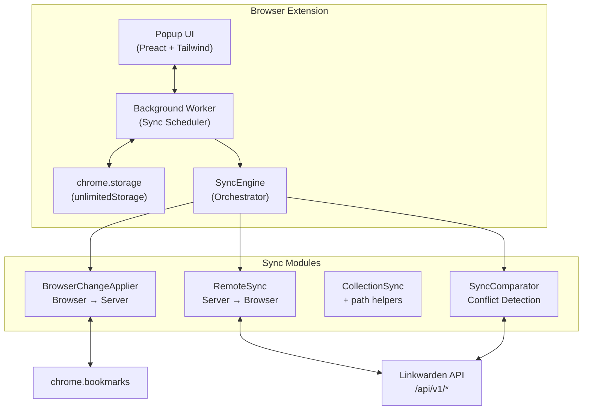
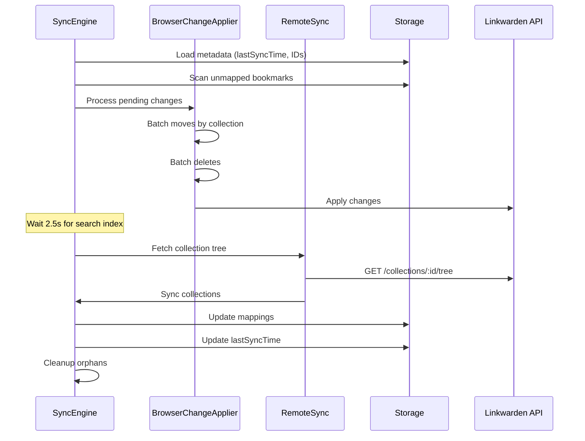
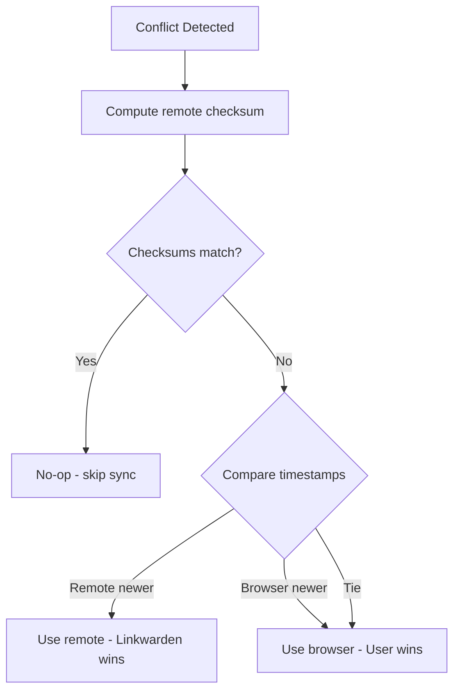
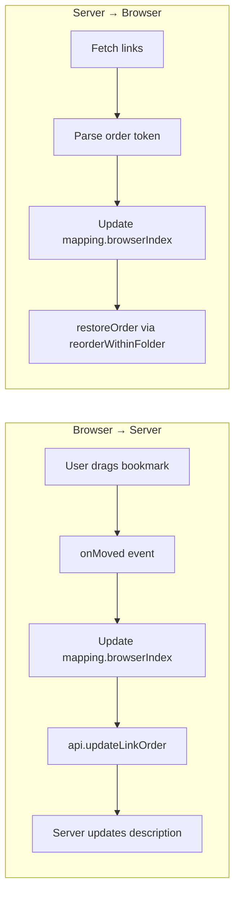
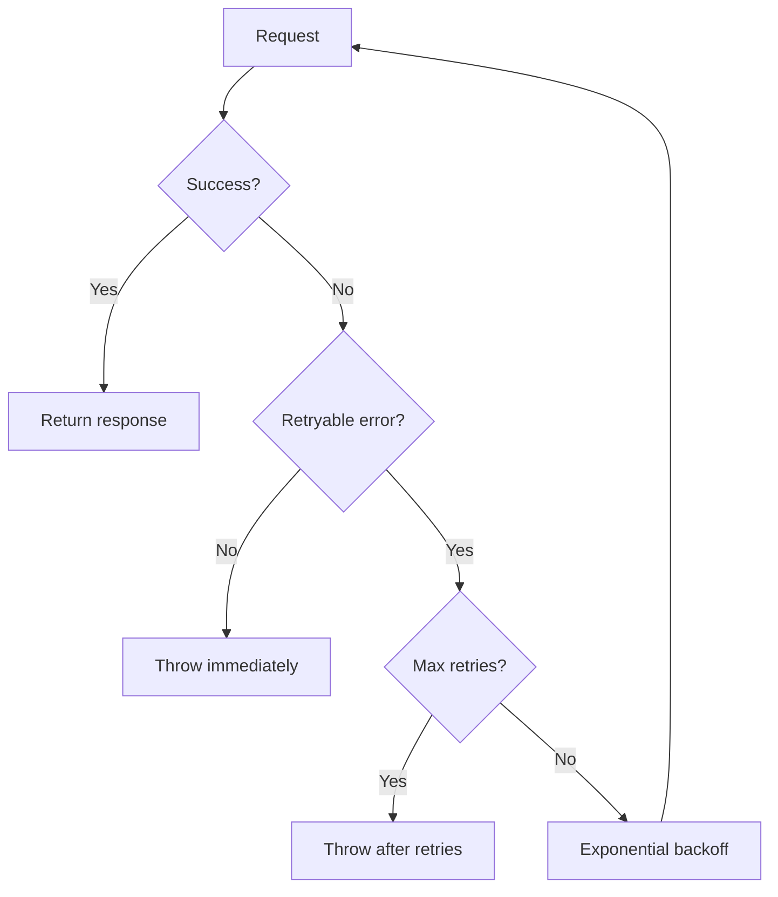
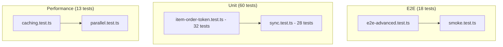

# Linkwarden Browser Extension - Design Document

**Status:** ✅ Consolidation Complete | **Modules:** 12 sync files (-20%) | **Tests:** 122 passing

Bidirectional sync between Linkwarden collections and browser bookmarks. Manifest V3 (Chrome, Firefox 128+, Edge).

---

## 1. System Architecture


```mermaid
flowchart TB
    subgraph Extension["Browser Extension"]
        UI["Popup UI<br/>(Preact + Tailwind)"]
        BG["Background Worker<br/>(Sync Scheduler)"]
        Storage["chrome.storage<br/>(unlimitedStorage)"]
        Engine["SyncEngine<br/>(Orchestrator)"]
    end
    
    subgraph Sync["Sync Modules"]
        Browser["BrowserChangeApplier<br/>Browser → Server"]
        Remote["RemoteSync<br/>Server → Browser"]
        Collection["CollectionSync<br/>+ path helpers"]
        Comparator["SyncComparator<br/>Conflict Detection"]
    end
    
    API["Linkwarden API<br/>/api/v1/*"]
    Bookmarks["chrome.bookmarks"]
    
    UI <--> BG
    BG <--> Storage
    BG --> Engine
    Engine --> Browser
    Engine --> Remote
    Engine --> Comparator
    Browser <--> Bookmarks
    Remote <--> API
    Comparator <--> API
```

### Module Responsibilities

| Module | Responsibility | LOC |
|--------|---------------|-----|
| **SyncEngine** | Orchestrates sync cycle, coordinates modules | ~350 |
| **BrowserChangeApplier** | Browser → Server (create, update, delete, move) + BatchOperations | ~580 |
| **RemoteSync** | Server → Browser (fetch tree, apply changes) | ~200 |
| **CollectionSync** | Collection + Link sync, path helpers, order restoration | ~1200 |
| **SyncComparator** | Compare browser/server, detect conflicts | ~700 |
| **SyncInitializer** | First-time setup, collection creation | ~240 |
| **OrphanCleanup** | Remove deleted items from mappings | ~200 |
| **Moves** | Move token parsing/validation | ~100 |
| **Conflict** | Checksum + LWW resolution | ~50 |
| **ItemOrderToken** | Order token generation/parsing | ~200 |
| **ErrorReporter** | Cross-module error collection | ~150 |

---

## 2. Sync Flow

### 2.1 Full Sync Sequence


```mermaid
sequenceDiagram
    participant E as SyncEngine
    participant B as BrowserChangeApplier
    participant R as RemoteSync
    participant S as Storage
    participant A as Linkwarden API
    
    E->>S: Load metadata (lastSyncTime, IDs)
    E->>S: Scan unmapped bookmarks
    E->>B: Process pending changes
    B->>B: Batch moves by collection
    B->>B: Batch deletes
    B->>A: Apply changes
    Note over E: Wait 2.5s for search index
    E->>R: Fetch collection tree
    R->>A: GET /collections/:id/tree
    R->>E: Sync collections
    E->>S: Update mappings
    E->>S: Update lastSyncTime
    E->>E: Cleanup orphans
```

### 2.2 Change Detection

| Direction | Mechanism | Trigger |
|-----------|-----------|---------|
| **Browser → Server** | Event listeners | `onCreated`, `onChanged`, `onRemoved`, `onMoved` |
| **Server → Browser** | Polling (5 min default) | Compare `updatedAt` timestamps |

### 2.3 Conflict Resolution


```mermaid
flowchart TD
    A[Conflict Detected] --> B[Compute remote checksum]
    B --> C{Checksums match?}
    C -->|Yes| D[No-op - skip sync]
    C -->|No| E{Compare timestamps}
    E -->|Remote newer| F[Use remote - Linkwarden wins]
    E -->|Browser newer| G[Use browser - User wins]
    E -->|Tie| G
```

**LWW Implementation:**
```typescript
function resolveConflict(local: Mapping, remote: LinkwardenLink): ConflictResult {
  if (local.checksum === computeChecksum(remote)) return "no-op";
  if (new Date(remote.updatedAt).getTime() > local.browserUpdatedAt) return "use-remote";
  return "use-local"; // Browser wins on tie
}
```

---

## 3. Data Model

### 3.1 Core Types

```typescript
interface Mapping {
  id: string;
  linkwardenType: "link" | "collection";
  linkwardenId: number;
  browserId: string;
  linkwardenUpdatedAt: number;
  browserUpdatedAt: number;
  lastSyncedAt: number;
  checksum: string;
  browserIndex?: number;      // Position in parent (order preservation)
  cachedName?: string;        // For order token hash regeneration
  cachedNameHash?: string;    // 8-char hash for order token
}

interface PendingChange {
  id: string;
  type: "create" | "update" | "delete" | "move";
  source: "browser" | "linkwarden";
  linkwardenId?: number;
  browserId?: string;
  parentId?: number | string;
  index?: number;             // Position for reorder detection
  oldParentId?: number | string;
  oldIndex?: number;
  data?: { url?: string; title?: string };
  timestamp: number;
  resolved: boolean;
}
```

### 3.2 Storage Schema

| Key | Type | Description |
|-----|------|-------------|
| `sync_metadata` | `SyncMetadata` | Last sync time, target IDs, sync direction |
| `mappings` | `Mapping[]` | ID mapping table (O(1) lookups) |
| `pending_changes` | `PendingChange[]` | Browser event queue |
| `settings` | `Settings` | User configuration |
| `sync_log` | `LogEntry[]` | Recent activity (max 100 entries) |

---

## 4. Order Preservation

### 4.1 Server-Side Order Tokens

**Format:** `[LW:O:{"47b2f5fa":"3"}]`

```
Description: "My bookmark [LW:O:{"47b2f5fa":"3"}]"
                          │    │           │
                          │    │           └─ Index (0-based)
                          │    └─ Name hash (8 chars)
                          └─ Prefix identifier
```

### 4.2 Order Sync Flow


```mermaid
flowchart LR
    subgraph Browser["Browser → Server"]
        B1[User drags bookmark] --> B2[onMoved event]
        B2 --> B3[Update mapping.browserIndex]
        B3 --> B4[api.updateLinkOrder]
        B4 --> B5[Server updates description]
    end
    
    subgraph Server["Server → Browser"]
        S1[Fetch links] --> S2[Parse order token]
        S2 --> S3[Update mapping.browserIndex]
        S3 --> S4[restoreOrder via reorderWithinFolder]
    end
```

### 4.3 Order Restoration

**Algorithm:**
1. Capture current browser order → `browserIndex`
2. Store in mapping table
3. On sync: compare stored vs current
4. If mismatch + browser newer → capture (user reorder)
5. If mismatch + server newer → restore (LWW)

---

## 5. Duplicate Handling

### 5.1 Three-Tier Strategy

```mermaid
flowchart TD
    A[Sync Collection] --> B{Tier 1: Mapping lookup?}
    B -->|Found| C[Use existing mapping O(1)]
    B -->|Not found| D{Tier 2: Name match?}
    D -->|Found| E[Create mapping for existing]
    D -->|Not found| F{Tier 3: Path match?}
    F -->|Found| G[Create mapping for path]
    F -->|Not found| H[Create new item]
```

| Tier | Strategy | Complexity | Hit Rate |
|------|----------|------------|----------|
| 1 | Mapping table lookup | O(1) | ~95% |
| 2 | Name matching under parent | O(n) | ~4% |
| 3 | Path-based matching | O(log n) | ~1% |

---

## 6. Folder Moves

### 6.1 Bidirectional Move Tracking

| Direction | Mechanism | Token |
|-----------|-----------|-------|
| **Browser → Server** | `onMoved` → append token → `updateCollection()` | `{LW:MOVE:{"to":id}}` |
| **Server → Browser** | Detect `parentId` change → `bookmarks.move()` | N/A |

### 6.2 Move Validation

```typescript
// Prevent circular moves
const isCircular = await isDescendantOf(folderBrowserId, targetParentId);
if (isCircular) throw new Error("Circular move detected");
```

---

## 7. API Client

### 7.1 Endpoints

| Method | Endpoint | Purpose |
|--------|----------|---------|
| `GET` | `/collections` | List all collections |
| `GET` | `/collections/:id/tree` | Get full hierarchy |
| `PUT` | `/collections/:id` | Update collection |
| `GET` | `/links?collectionId=:id` | Paginated links |
| `PUT` | `/links/:id` | Update link |
| `PUT` | `/links/:id/order` | Update order token |
| `DELETE` | `/links/:id` | Delete link |

### 7.2 Retry Strategy


```mermaid
flowchart TD
    A[Request] --> B{Success?}
    B -->|Yes| C[Return response]
    B -->|No| D{Retryable error?}
    D -->|No| E[Throw immediately]
    D -->|Yes| F{Max retries?}
    F -->|Yes| G[Throw after retries]
    F -->|No| H[Exponential backoff]
    H --> A
```

**Retryable:** Network failures, 5xx, 429 (with `Retry-After`)
**Non-retryable:** 4xx (except 429), 401, 404

---

## 8. Tech Stack

| Component | Technology | Version |
|-----------|------------|---------|
| **Extension** | Manifest V3 | Chrome, Firefox 128+, Edge |
| **Language** | TypeScript | 5.x |
| **Runtime** | Bun | 1.3.9 |
| **UI** | Preact | 10.28.4 |
| **Styling** | Tailwind CSS | 4.2.1 |
| **Bundler** | Bun build | Native |
| **Test Runner** | Bun test | `bun:test` |

---

## 9. Project Structure

```
src/
├── background.ts              # Service worker
├── api.ts                     # Linkwarden API client
├── bookmarks.ts               # Bookmarks wrapper
├── popup.tsx                  # UI (Preact + Tailwind)
├── sync/                      # 12 modules
│   ├── engine.ts              # Main orchestrator
│   ├── browser-changes.ts     # Browser → Server + BatchOperations
│   ├── remote-sync.ts         # Server → Browser
│   ├── collections.ts         # Collection + Link sync + path helpers
│   ├── comparator.ts          # Conflict detection
│   ├── initialization.ts      # First-time setup
│   ├── orphans.ts             # Orphan cleanup
│   ├── moves.ts               # Move tokens
│   ├── conflict.ts            # Checksum + LWW
│   ├── item-order-token.ts    # Order tokens
│   ├── errorReporter.ts       # Error collection
│   └── index.ts               # Barrel exports
├── storage/                   # Storage wrapper (4 modules)
├── types/                     # TypeScript types
└── utils/                     # Utilities

tests/
├── fixtures/                  # Test data factories
├── mocks/                     # Mock implementations
├── sync.test.ts               # Pure functions (28 tests)
├── item-order-token.test.ts   # Order tokens (32 tests)
├── smoke.test.ts              # E2E basic (~10s)
├── e2e-advanced.test.ts       # E2E advanced (~15s)
└── performance/               # Performance tests (13 tests)
```

---

## 10. Commands

```bash
# Development
bun install           # Install dependencies
bun run dev           # Watch mode (Chrome)
bun run build         # Build to dist/ (fast)
bun run build:prod    # Production build (container)

# Quality
bun run lint          # ESLint + type check
bun run format        # Prettier format
bun run quality       # Lint + format

# Testing
bun test              # All tests (122 tests, ~30s)
bun test tests/sync.test.ts              # Unit: pure functions
bun test tests/item-order-token.test.ts  # Unit: order tokens
bun test tests/smoke.test.ts             # E2E: real API
bun test tests/e2e-advanced.test.ts      # E2E: advanced

# Packaging
bun run zip           # Package for distribution
bun run package       # Build + zip
bun run verify        # Verify checksums
```

---

## 11. Key Design Decisions

| # | Decision | Rationale |
|---|----------|-----------|
| 1 | `chrome.storage.local` + `unlimitedStorage` | Simpler than IndexedDB, no quota limits |
| 2 | Mapping table = source of truth | O(1) lookups, never search after first sync |
| 3 | Polling over Webhooks | Linkwarden lacks WebSocket API |
| 4 | Folder-per-Collection | 1:1 mapping, tags not synced |
| 5 | No content archival | URLs/titles only |
| 6 | LWW conflict resolution | Simple, debuggable |
| 7 | Server-side order tokens | Cross-device sync |
| 8 | Batch API operations | 10x faster than sequential |
| 9 | Path-based fallback | Recovery when mappings lost |
| 10 | Move tokens in description | Track moves without API support |
| 11 | Error reporter pattern | Collect errors without failing sync |
| 12 | Deterministic builds | Reproducible via container |

---

## 12. Risks & Mitigations

| Risk | Mitigation |
|------|------------|
| **Clock skew** | Use server timestamps, 1s tolerance |
| **Large collections** | Paginate requests, batch operations |
| **Circular moves** | `isDescendantOf()` validation |
| **Token expiration** | Handle 401, prompt refresh |
| **Duplicate names** | Mapping-first, path fallback |
| **Lost mappings** | Recovery utility rebuilds from hierarchy |
| **API eventual consistency** | Wait 2.5s after creation |
| **Order token corruption** | Hash validation, auto-regenerate |

---

## 13. Testing Strategy

### Test Pyramid


```mermaid
flowchart TD
    subgraph E2E["E2E (18 tests)"]
        E1["smoke.test.ts"]
        E2["e2e-advanced.test.ts"]
    end
    
    subgraph Unit["Unit (60 tests)"]
        U1["sync.test.ts - 28 tests"]
        U2["item-order-token.test.ts - 32 tests"]
    end
    
    subgraph Perf["Performance (13 tests)"]
        P1["parallel.test.ts"]
        P2["caching.test.ts"]
    end
    
    E2 --> E1
    U2 --> U1
    P2 --> P1
```

### Test Infrastructure

| Module | Purpose |
|--------|---------|
| **Factories** | `createMapping()`, `createLink()`, `createCollection()` |
| **Mocks** | `MockStorage`, `MockBookmarks`, `MockLinkwardenAPI` |
| **Builders** | Fluent test data builders |
| **Utilities** | `uniqueId()`, `uniqueUrl()`, `timestamp()` |

**Rule:** Never mock system-under-test. Only mock browser APIs.

---

## 14. Loading the Extension

**Chrome/Edge:**
1. `chrome://extensions/` → Developer mode
2. Load unpacked → `dist/chrome/`

**Firefox:**
1. `about:debugging` → Load Temporary Add-on
2. Select `dist/firefox/manifest.json`

---

## 15. Implementation Status

| Phase | Feature | Status |
|-------|---------|--------|
| 1 | Foundation (manifest, storage, API) | ✅ |
| 2 | One-way sync (Server → Browser) | ✅ |
| 3 | Bidirectional sync + conflicts | ✅ |
| 4 | Polish (error handling, deduplication) | ✅ |
| 5 | Deterministic builds | ✅ |
| 6 | Firefox MV3 migration | ✅ |
| 7 | UI + Tailwind CSS v4 | ✅ |
| 8 | Test suite consolidation | ✅ |
| 9 | Bookmark order preservation | ✅ |
| 10 | Optimized fetch + API compliance | ✅ |
| 11 | Server-side order tokens | ✅ |
| 12 | **Code consolidation (-3 modules)** | ✅ |

---

**Last Updated:** 2026-03-06
**Version:** 1.0.0
**Sync Modules:** 12 files (was 15)
