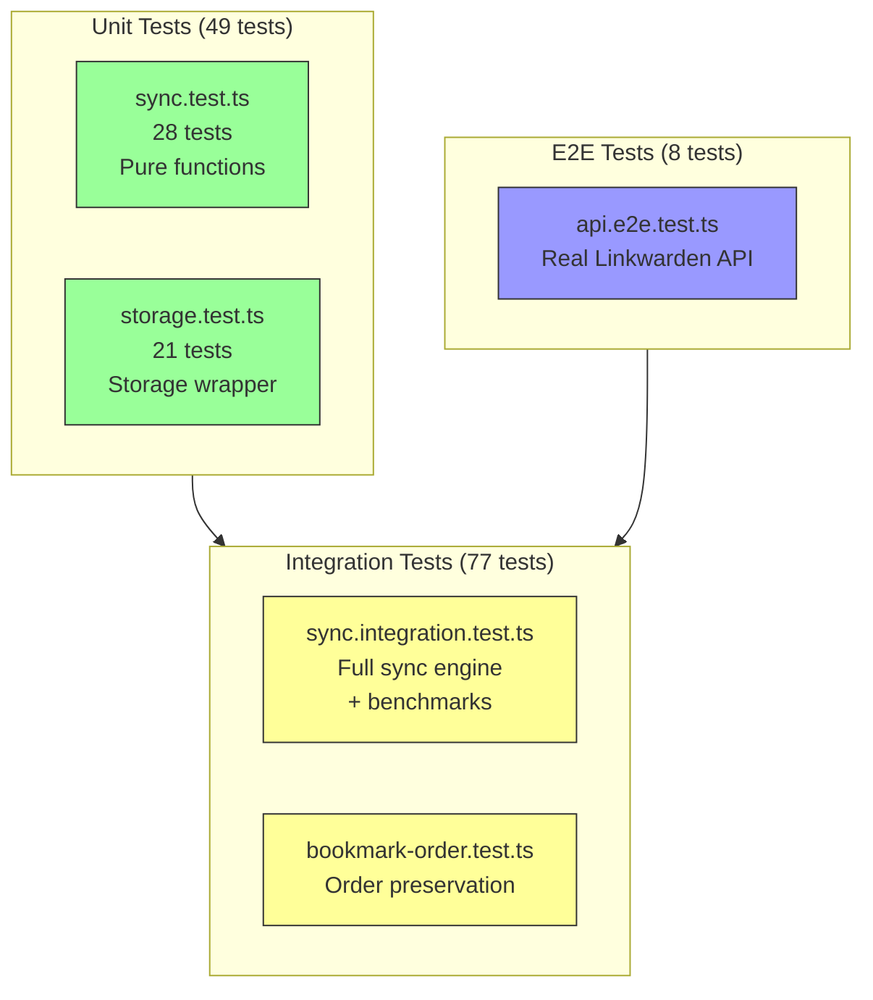

# Test Suite Design Document

**Status:** ✅ Complete (134 tests passing = 100%)
**Last Updated:** 2026-03-05

Comprehensive test suite for the Linkwarden sync extension using Bun's test runner.

---

## 1. Overview

| Metric          | Value                  |
| --------------- | ---------------------- |
| **Total Tests** | 134                    |
| **Test Files**  | 5                      |
| **Framework**   | Bun test (`bun:test`)  |
| **Coverage**    | Unit, Integration, E2E |
| **Pass Rate**   | 100% (134/134)         |

**Run Commands:**

```bash
bun test                              # All tests
bun test tests/sync.test.ts           # Unit tests only (28 tests)
bun test tests/storage.test.ts        # Storage tests only (21 tests)
bun test tests/api.e2e.test.ts        # API E2E only (8 tests)
bun test tests/sync.integration.test.ts  # Integration only (52 tests)
bun test tests/bookmark-order.test.ts # Order preservation only (13 tests)
```

**Test Configuration:**

All tests use `TEST_COLLECTION` from environment variables (default: 114 "Unorganized").
Set via `.env` file or environment variable.

**Recent Changes:**

- ✅ Refactored mocks to use `TEST_COLLECTION` from env (2026-03-04)
- ✅ Added test configuration utilities (`tests/utils/config.ts`)
- ✅ Updated all fixtures to use dynamic collection IDs
- ✅ Removed bulk operations tests (undocumented API endpoints)
- ✅ Added retry logic tests for `/search` eventual consistency
- ✅ All 134 tests passing (100%)

---

## 2. Test Philosophy

**Golden Rule:** Never mock the system-under-test.

| Test Type       | Mock Policy                         |
| --------------- | ----------------------------------- |
| **Unit**        | Pure functions only - no mocks      |
| **Integration** | Mock browser APIs only (`chrome.*`) |
| **E2E**         | No mocks - real Linkwarden API      |

**Rationale:** Test business logic in isolation; mock only uncontrollable external dependencies.

---

## 3. Test Suite Structure

```
tests/
├── fixtures/               # Test data factories
│   ├── index.ts            # Barrel exports
│   ├── mapping.ts          # Mapping factory
│   ├── metadata.ts         # SyncMetadata factory
│   ├── change.ts           # PendingChange factory
│   ├── collection.ts       # LinkwardenCollection factory (uses TEST_COLLECTION)
│   ├── link.ts             # LinkwardenLink factory (uses TEST_COLLECTION)
│   └── bookmark.ts         # BookmarkNode factory
├── mocks/                  # Mock implementations
│   ├── index.ts            # Barrel exports
│   ├── storage.ts          # MockStorage class
│   ├── bookmarks.ts        # MockBookmarks class
│   ├── browser.ts          # Browser mocks coordinator
│   └── linkwarden.ts       # MockLinkwardenAPI class (uses TEST_COLLECTION)
├── utils/                  # Test utilities
│   ├── index.ts            # Barrel exports
│   ├── generators.ts       # ID/time generators
│   ├── cleanup.ts          # Cleanup helpers
│   └── config.ts           # Test configuration
├── sync.test.ts            # Unit: Pure functions (28 tests)
├── storage.test.ts         # Unit: Storage wrapper (21 tests)
├── api.e2e.test.ts         # E2E: Real Linkwarden API (8 tests)
├── sync.integration.test.ts # Integration: Full sync engine (52 tests)
└── bookmark-order.test.ts   # Order preservation (13 tests)
```

### 3.1 Test Suite Overview



---

## 4. Test Infrastructure

### 4.1 Factories (`tests/fixtures/`)

**Purpose:** Provide reusable test data creation with sensible defaults.

| Factory         | Functions                                                            | Example                                   |
| --------------- | -------------------------------------------------------------------- | ----------------------------------------- |
| `mapping.ts`    | `createMapping()`, `createCollectionMapping()`                       | `createMapping({ linkwardenId: 1 })`      |
| `metadata.ts`   | `createSyncMetadata()`                                               | `createSyncMetadata({ lastSyncTime: 0 })` |
| `change.ts`     | `createChange()`, `updateChange()`, `deleteChange()`, `moveChange()` | `createChange({ type: "create" })`        |
| `collection.ts` | `createCollection()`, `createSubcollection()`                        | `createCollection({ name: "Test" })`      |
| `link.ts`       | `createLink()`, `createLinkWithDetails()`                            | `createLink(1, { url: "https://..." })`   |
| `bookmark.ts`   | `createBookmark()`, `createBookmarkFolder()`                         | `createBookmark({ title: "Test" })`       |

**Example Usage:**

```typescript
import { createMapping } from "./fixtures/mapping";
import { createSyncMetadata } from "./fixtures/metadata";

// Create mapping with defaults, override specific fields
const mapping = createMapping({
  linkwardenId: 1,
  browserId: "bookmark-1",
  checksum: "abc123",
});

// Create sync metadata
const metadata = createSyncMetadata({
  lastSyncTime: 0,
  targetCollectionId: 1,
});
```

### 4.2 Mocks (`tests/mocks/`)

**Purpose:** Provide realistic mock implementations of browser and external APIs.

| Mock            | Class/Function                                 | Description                                   |
| --------------- | ---------------------------------------------- | --------------------------------------------- |
| `storage.ts`    | `MockStorage`                                  | In-memory chrome.storage.local implementation |
| `bookmarks.ts`  | `MockBookmarks`                                | In-memory bookmark tree with event support    |
| `browser.ts`    | `setupBrowserMocks()`, `cleanupBrowserMocks()` | Install/remove all browser mocks              |
| `linkwarden.ts` | `MockLinkwardenAPI`                            | In-memory Linkwarden API implementation       |

**Example Usage:**

```typescript
import { setupBrowserMocks, cleanupBrowserMocks } from "./mocks/browser";
import { MockLinkwardenAPI } from "./mocks/linkwarden";

let mocks: ReturnType<typeof setupBrowserMocks>;
let mockApi: MockLinkwardenAPI;

beforeEach(() => {
  mocks = setupBrowserMocks();
  mockApi = new MockLinkwardenAPI();
});

afterEach(() => {
  cleanupBrowserMocks();
});
```

### 4.3 Utilities (`tests/utils/`)

**Purpose:** Provide common test helpers and generators.

| Utility         | Functions                                                                     | Description               |
| --------------- | ----------------------------------------------------------------------------- | ------------------------- |
| `generators.ts` | `uniqueId()`, `uniqueUrl()`, `uniqueTitle()`, `timestamp()`, `isoTimestamp()` | Generate unique test data |
| `cleanup.ts`    | `clearStorage()`, `clearBookmarks()`, `fullCleanup()`                         | Clean up test state       |

**Example Usage:**

```typescript
import { uniqueUrl, uniqueTitle, timestamp } from "./utils/generators";

// Generate unique test data
const url = uniqueUrl(); // "https://test-123456-abc123.example.com"
const title = uniqueTitle("Test"); // "Test 1234567890"
const now = timestamp(); // Current timestamp
const past = timestamp(-60000); // 1 minute ago
```

---

## 5. Test Files

### 5.1 `sync.test.ts` - Unit Tests (28 tests)

**Purpose:** Test pure functions in isolation.

**What's Tested:**
| Function | Tests | Purpose |
|----------|-------|---------|
| `computeChecksum()` | 5 | Hash generation for change detection |
| `resolveConflict()` | 6 | LWW conflict resolution logic |
| `appendMoveToken()` | 3 | Token creation for folder moves |
| `extractMoveToken()` | 6 | Token parsing from descriptions |
| `removeMoveToken()` | 6 | Token cleanup after moves |
| `parseFolderPath()` | 2 | Path string → array parsing |

**Mock Policy:** None - pure functions only.

**Example:**

```typescript
import { resolveConflict } from "../src/sync";
import { createMapping } from "../fixtures/mapping";

test("returns use-remote when remote is newer", () => {
  const mapping = createMapping({
    linkwardenUpdatedAt: 1000,
    browserUpdatedAt: 2000,
  });
  const remote = {
    name: "Test",
    url: "https://example.com",
    updatedAt: new Date(3000).toISOString(),
  };
  const result = resolveConflict(mapping, remote);
  expect(result).toBe("use-remote");
});
```

---

### 5.2 `storage.test.ts` - Storage Unit Tests (21 tests)

**Purpose:** Test `chrome.storage.local` wrapper functions.

**What's Tested:**
| Category | Tests | Functions |
|----------|-------|-----------|
| `getAll/saveAll` | 2 | Bulk storage operations |
| Sync Metadata | 3 | `saveSyncMetadata`, `getSyncMetadata` |
| Mappings | 8 | `upsertMapping`, `getMappings`, `getMappingBy*`, `removeMapping` |
| Pending Changes | 4 | `addPendingChange`, `resolvePendingChange`, `cleanupResolvedChanges` |
| Settings | 3 | `saveSettings`, `getSettings`, updates |
| Utilities | 2 | `clearAll`, `getStorageUsage` |

**Mock Policy:** Uses `setupBrowserMocks()` from `tests/mocks/browser`.

**Example:**

```typescript
import { setupBrowserMocks, cleanupBrowserMocks } from "../mocks/browser";
import { createMapping } from "../fixtures/mapping";

let mocks: ReturnType<typeof setupBrowserMocks>;

beforeEach(() => {
  mocks = setupBrowserMocks();
});

afterEach(() => {
  cleanupBrowserMocks();
});

test("should add and retrieve a mapping", async () => {
  const mapping = createMapping({
    linkwardenId: 1,
    browserId: "bookmark-1",
    checksum: "abc123",
  });

  await storage.upsertMapping(mapping);
  const mappings = await storage.getMappings();

  expect(mappings.length).toBe(1);
  expect(mappings[0]).toEqual(mapping);
});
```

---

### 5.3 `api.e2e.test.ts` - API E2E Tests (8 tests)

**Purpose:** Test Linkwarden API client with real server.

**What's Tested:**

**Core API (8 tests):**
| Test | Purpose |
|------|---------|
| Find collection by name | Verify target collection exists |
| Create link | POST `/api/v1/links` |
| Update link | PUT `/api/v1/links/:id` |
| Delete link | DELETE `/api/v1/links/:id` |
| Create/delete subcollection | POST/DELETE `/api/v1/collections` |
| Test connection | Auth validation |
| Invalid credentials | Error handling |
| Fetch collection tree | Recursive collection fetching |

**Mock Policy:** None - real Linkwarden API calls.

**Configuration:** Uses `.env` file for credentials:

```
ENDPOINT=https://your-linkwarden-instance.com
COLLECTION=Bookmarks
```

**Cleanup:** Auto-deletes created links/subcollections in `afterEach`.

**Note:** Bulk operations (`PUT /api/v1/links`) are tested via mock API in `sync.integration.test.ts` since not all Linkwarden instances support this endpoint.

---

### 5.4 `sync.integration.test.ts` - Integration Tests (52 tests)

**Purpose:** Test full sync engine with mocked browser APIs.

**What's Tested:**

**Initial Sync (2 tests):**

- Sync links from Linkwarden to browser on first sync
- Handle empty collection gracefully

**Incremental Sync (2 tests):**

- Skip already synced items with no changes
- Update browser bookmark when Linkwarden link changes

**Conflict Resolution (2 tests):**

- Prefer browser changes when browser is newer
- Handle checksum match as no-op

**Error Handling (3 tests):**

- Handle missing sync metadata
- Handle invalid collection ID
- Continue sync even if one link fails

**Round-Trip Scenarios (10+ tests):**

- Browser → Server: Push new bookmarks
- Browser → Server: Update Linkwarden links
- Server → Browser: Detect remote changes
- Delete propagation both directions

**Subcollection Support (5+ tests):**

- Sync nested subcollections
- Handle duplicate folder names using path-based matching
- Verify correct parent-child mappings

**Folder Moves (4 tests):**

- Browser → Server move using description token
- Server → Browser move via `parentId` change
- Circular move prevention
- Token extraction/cleanup

**Bookmark Scanner (3 tests):**

- Detect and queue unmapped bookmarks
- Skip already mapped bookmarks
- Scan nested folders for unmapped items

**Duplicate Handling (1 test):**

- Deduplicate same URL in multiple folders

**Performance (1 test):**

- Handle 100+ items efficiently (< 1 second)

**Collection ID Configuration (6 tests):**

- Use collection ID from settings
- Fall back to name lookup
- Handle invalid ID gracefully

**Bulk Link Operations (10+ tests):**

- Bulk move links to different collection
- Preserve order during bulk moves
- Handle multiple simultaneous moves
- Performance: 100 link moves (< 500ms)

**Mock Policy:**

- `MockLinkwardenAPI` - Full in-memory API implementation
- `chrome.storage.local` - Via `MockStorage` class
- `chrome.bookmarks` - Via `MockBookmarks` class

**Example:**

```typescript
import { setupBrowserMocks, cleanupBrowserMocks } from "../mocks/browser";
import { MockLinkwardenAPI } from "../mocks/linkwarden";

let mocks: ReturnType<typeof setupBrowserMocks>;
let mockApi: MockLinkwardenAPI;
let syncEngine: SyncEngine;

beforeEach(() => {
  mocks = setupBrowserMocks();
  mockApi = new MockLinkwardenAPI();
  syncEngine = new SyncEngine(mockApi as unknown as LinkwardenAPI);
});

afterEach(() => {
  cleanupBrowserMocks();
});

test("should handle browser → server folder move", async () => {
  // Create collection and sync
  const collection = await mockApi.createCollection("Test Folder", 1);
  await syncEngine.sync();

  // Simulate browser move event
  await storage.addPendingChange({
    id: crypto.randomUUID(),
    type: "move",
    source: "browser",
    browserId: "folder-1",
    parentId: "new-parent-id",
    timestamp: Date.now(),
    resolved: false,
  });

  // Sync and verify move token was processed
  await syncEngine.sync();
  const updated = await mockApi.getCollection(collection.id);
  expect(updated.parentId).toBe(1); // New parent
});
```

---

### 5.5 `bookmark-order.test.ts` - Order Preservation Tests (13 tests)

**Purpose:** Test bookmark order preservation using `browserIndex` metadata.

**What's Tested:**

**Index Capture (3 tests):**

- Capture index when bookmark is reordered within same folder
- Distinguish reorder (same parent) from move (different parent)
- Capture index for both links and folders

**Order Restoration (4 tests):**

- Restore order after sync using browserIndex
- Restore order for multiple bookmarks in same folder
- Handle order restoration when parent changes
- Preserve order across multiple sync cycles

**Conflict Resolution (3 tests):**

- Prefer browser order when browser is newer (LWW)
- Use server order when checksums match (no user reorder)
- Normalize indices after deletions

**Scenario: 3 Bookmarks + 1 Subfolder (2 tests):**

- Handle complete reorder scenario with mixed content
- Handle subfolder with its own internal order

**Performance (1 test):**

- Handle 100+ bookmarks in same folder (< 1 second)

**Edge Cases (2 tests):**

- Handle move to unmapped folder gracefully
- Preserve order when link is moved back and forth

**Mock Policy:**

- `MockLinkwardenAPI` - Full in-memory API implementation
- `chrome.storage.local` - Via `MockStorage` class
- `chrome.bookmarks` - Via `MockBookmarks` class

**Example:**

```typescript
import { setupBrowserMocks, cleanupBrowserMocks } from "./mocks/browser";
import { MockLinkwardenAPI } from "./mocks/linkwarden";
import { SyncEngine } from "../src/sync";

let mocks: ReturnType<typeof setupBrowserMocks>;
let mockApi: MockLinkwardenAPI;
let syncEngine: SyncEngine;

beforeEach(() => {
  mocks = setupBrowserMocks();
  mockApi = new MockLinkwardenAPI();
  syncEngine = new SyncEngine(mockApi as unknown as LinkwardenAPI);
});

afterEach(() => {
  cleanupBrowserMocks();
});

test("should restore bookmark order after sync using browserIndex", async () => {
  // Arrange: Create collection with 3 links
  const collection = await mockApi.createCollectionWithId(
    TARGET_COLLECTION_ID,
    "Unorganized"
  );

  await mockApi.createLink("https://first.com", collection.id, "First");
  await mockApi.createLink("https://second.com", collection.id, "Second");
  await mockApi.createLink("https://third.com", collection.id, "Third");

  // Initial sync
  await syncEngine.sync();

  // Set custom order: 1, 2, 0 (instead of 0, 1, 2)
  const children = await bookmarks.getChildren(BROWSER_ROOT_FOLDER_ID);
  // ... set browserIndex for each mapping

  // Act: Sync again - should restore order
  await syncEngine.sync();

  // Assert: Order restored
  expect(children[0].title).toBe("Second");
  expect(children[1].title).toBe("Third");
  expect(children[2].title).toBe("First");
});
```

---

## 6. Test Coverage Matrix

| Feature                  | Unit | Storage | API E2E | Integration | Order |
| ------------------------ | ---- | ------- | ------- | ----------- | ----- |
| Checksum computation     | ✅   | -       | -       | -           | -     |
| Conflict resolution      | ✅   | -       | -       | ✅          | -     |
| Move token helpers       | ✅   | -       | -       | -           | -     |
| Path parsing             | ✅   | -       | -       | -           | -     |
| Storage CRUD             | -    | ✅      | -       | ✅          | -     |
| Linkwarden API           | -    | -       | ✅      | -           | -     |
| Initial sync             | -    | -       | -       | ✅          | -     |
| Incremental sync         | -    | -       | -       | ✅          | -     |
| Browser → Server         | -    | -       | -       | ✅          | -     |
| Server → Browser         | -    | -       | -       | ✅          | -     |
| Subcollections           | -    | -       | -       | ✅          | ✅    |
| Folder moves             | -    | -       | -       | ✅          | ✅    |
| Duplicate handling       | -    | -       | -       | ✅          | -     |
| Error handling           | -    | -       | -       | ✅          | -     |
| Bookmark scanner         | -    | -       | -       | ✅          | -     |
| Performance (100+ items) | -    | -       | -       | ✅          | ✅    |
| Collection ID config     | -    | -       | -       | ✅          | -     |
| Order preservation       | -    | -       | -       | -           | ✅    |
| Optimized fetch          | -    | -       | -       | ✅          | -     |
| Retry logic              | -    | -       | ✅      | ✅          | -     |

---

## 7. Writing New Tests

### 7.1 Test Naming Convention

Use descriptive names that explain the expected behavior:

```typescript
test("should <action> when <condition>", async () => {
  // Test implementation
});

// Examples:
test("should create mapping when link is synced");
test("should skip already synced items with no changes");
test("should prefer browser changes when browser is newer");
```

### 7.2 Test Structure (Arrange-Act-Assert)

```typescript
test("should do something", async () => {
  // Arrange: Set up test data
  const mapping = createMapping({ linkwardenId: 1 });
  await storage.upsertMapping(mapping);

  // Act: Execute the code under test
  const result = await storage.getMappings();

  // Assert: Verify the result
  expect(result.length).toBe(1);
  expect(result[0].linkwardenId).toBe(1);
});
```

### 7.3 Using Factories

```typescript
import { createMapping, createCollectionMapping } from "./fixtures/mapping";
import { createLink } from "./fixtures/link";
import { createPendingChange } from "./fixtures/change";

// Basic usage with defaults
const mapping = createMapping();

// Override specific fields
const mapping = createMapping({
  linkwardenId: 42,
  checksum: "custom-checksum",
});

// Use specialized factories
const collectionMapping = createCollectionMapping({ browserId: "folder-1" });
const change = createPendingChange({ type: "update" });
```

### 7.4 Using Mocks

```typescript
import { setupBrowserMocks, cleanupBrowserMocks } from "./mocks/browser";
import { MockLinkwardenAPI } from "./mocks/linkwarden";

let mocks: ReturnType<typeof setupBrowserMocks>;
let mockApi: MockLinkwardenAPI;

beforeEach(() => {
  // Install mocks
  mocks = setupBrowserMocks();
  mockApi = new MockLinkwardenAPI();
});

afterEach(() => {
  // Cleanup mocks
  cleanupBrowserMocks();
});

// Use mock API
await mockApi.createLink("https://example.com", 1, "Test");

// Use mock browser
const bookmark = await new Promise<chrome.bookmarks.BookmarkTreeNode>(
  (resolve) => {
    chrome.bookmarks.create({ parentId: "2", title: "Test" }, resolve);
  }
);
```

### 7.5 Using Utilities

```typescript
import { uniqueUrl, uniqueTitle, timestamp } from "./utils/generators";

test("should handle unique data", async () => {
  const url = uniqueUrl(); // Unique URL
  const title = uniqueTitle("Test"); // Unique title
  const oldTime = timestamp(-60000); // 1 minute ago

  // Use in test
  await mockApi.createLink(url, 1, title);
});
```

---

## 8. Related Documents

- `PLAN.md` - Test mocks centralization plan
- `DESIGN.md` - System architecture and design decisions (includes Tailwind CSS v4 migration)
- `AGENTS.md` - Quick reference for development commands
- `MEMORY.md` - Current session notes and progress
- `README.md` - User documentation and privacy policy

---

## 9. UI Component Testing

**Status:** Manual testing via watch mode

### Current Approach

UI components built with Tailwind CSS v4 are tested manually during development:

```bash
bun run dev  # Watch mode with hot-reload
```

**Why Manual Testing:**

- UI is simple (popup with ~400px width)
- Visual changes are immediately visible in browser
- Tailwind utility classes reduce styling bugs
- Components use Preact with hooks (easy to reason about)

### Component Structure

```
src/popup/
├── ui/             # Reusable primitives (Button, Input, Section, Spinner, StatusRow)
├── components/     # Feature components (ConfigSection, LogSection, StatusMessage)
├── sections/       # Page sections (ServerCollection, SyncSettings, BookmarkFolder)
└── hooks/          # Custom hooks (useSettings, useSyncStatus, useSyncActions)
```

### Future Testing Opportunities

If UI complexity increases, consider adding:

| Test Type             | Tool                      | Purpose                                |
| --------------------- | ------------------------- | -------------------------------------- |
| **Component tests**   | `@testing-library/preact` | Test component rendering, interactions |
| **Visual regression** | `playwright`              | Screenshot comparison for UI changes   |
| **E2E tests**         | `playwright`              | Full popup interaction flows           |
| **Accessibility**     | `axe-core`                | A11y compliance checks                 |

**Decision:** Keep manual testing for now. Add automated UI tests if:

- Component count grows significantly
- Visual regression issues reported
- Accessibility compliance required

---

## 10. Tailwind CSS v4 Testing

**Build Verification:**

CSS is built separately and verified visually:

```bash
# Build CSS
bunx @tailwindcss/cli -i src/popup/styles.css -o dist/chrome/popup.css --minify

# Load dist/chrome/ as unpacked extension
# Manually verify popup rendering, dark mode, responsiveness
```

**What to Check:**

- ✅ All components render correctly
- ✅ Dark mode works (if enabled)
- ✅ No console errors
- ✅ Responsive layout fits popup dimensions (425x400-650px)
- ✅ Buttons, inputs, sections have consistent styling

**Deterministic Builds:**

CSS builds are deterministic (same input → same output):

```bash
bun run verify  # Verify checksums
```
