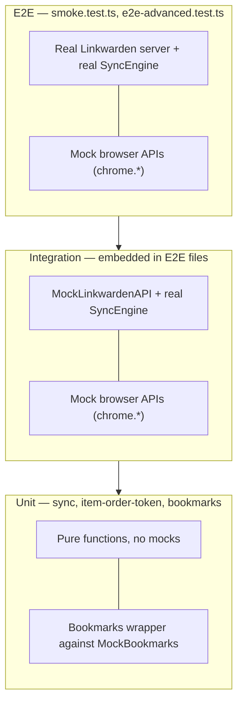
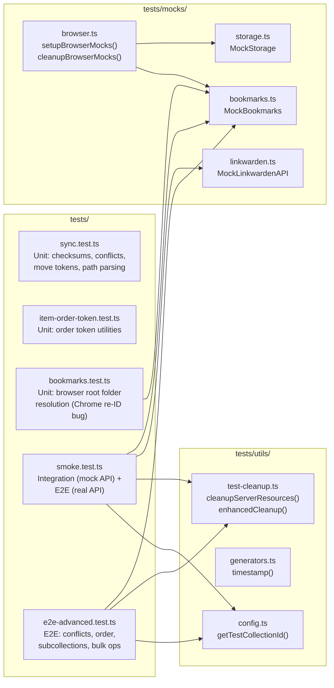
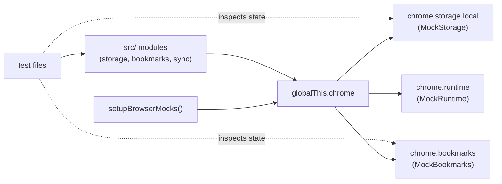
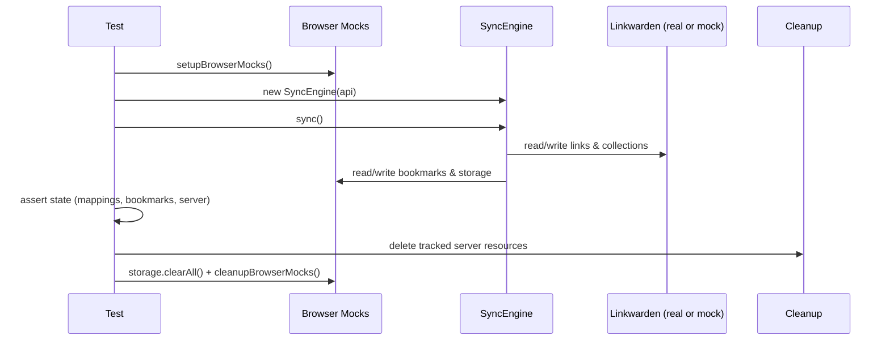

# Test Suite Design Document

**Status:** ✅ Current | **Framework:** Bun test (`bun:test`) | **Layers:** Unit + E2E (integration embedded)

Test suite for Linkwarden sync extension. This document covers test architecture, methodology, and conventions — not test counts (run `bun test` for those).

---

## 1. Overview

| Aspect             | Value                                             |
| ------------------ | ------------------------------------------------- |
| **Framework**      | Bun test (`bun:test`)                             |
| **Layers**         | Unit (no mocks) + E2E (real server, mock browser) |
| **Integration**    | Embedded in E2E files (mock API sections)         |
| **E2E dependency** | Live Linkwarden instance via `.env`               |

**Run Commands:**

```bash
bun test                          # All tests
bun test tests/sync.test.ts       # Unit: sync engine pure functions
bun test tests/item-order-token.test.ts  # Unit: order tokens
bun test tests/bookmarks.test.ts  # Unit: bookmarks wrapper
bun test tests/smoke.test.ts      # E2E: basic scenarios
bun test tests/e2e-advanced.test.ts    # E2E: advanced scenarios
```

**E2E Environment** (from `.env`):

- `ENDPOINT` — Linkwarden server URL
- `API_KEY` — API access token
- `TEST_COLLECTION` — target collection ID (default: 114 "Unorganized")

E2E describes skip cleanly when `ENDPOINT`/`API_KEY` are unset, so the suite always runs in CI without credentials (E2E sections are skipped, unit + mock sections run).

---

## 2. Test Philosophy

**Golden Rule:** Never mock the system under test. Only mock browser APIs that don't exist in the test environment (`chrome.*`). `SyncEngine` and the real `LinkwardenAPI` always run for real; the Linkwarden server is real in E2E and in-memory in the mock sections.

### Test Pyramid


```mermaid
flowchart TD
    subgraph E2E["E2E — smoke.test.ts, e2e-advanced.test.ts"]
        direction TB
        E2E1["Real Linkwarden server + real SyncEngine"]
        E2E2["Mock browser APIs (chrome.*)"]
        E2E1 --- E2E2
    end

    subgraph Integration["Integration — embedded in E2E files"]
        direction TB
        I1["MockLinkwardenAPI + real SyncEngine"]
        I2["Mock browser APIs (chrome.*)"]
        I1 --- I2
    end

    subgraph Unit["Unit — sync, item-order-token, bookmarks"]
        direction TB
        U1["Pure functions, no mocks"]
        U2["Bookmarks wrapper against MockBookmarks"]
        U1 --- U2
    end

    E2E --> Integration --> Unit
```

| Layer           | Mock Policy                             | Purpose                                                             |
| --------------- | --------------------------------------- | ------------------------------------------------------------------- |
| **Unit**        | None (or `MockBookmarks` only)          | Core logic in isolation: checksums, conflicts, tokens, path parsing |
| **Integration** | Mock browser APIs + `MockLinkwardenAPI` | Full sync engine without a server; fast, deterministic              |
| **E2E**         | Mock browser APIs only                  | Real user scenarios against a live Linkwarden instance              |

**Rationale:**

- Minimal mocking reduces maintenance and increases confidence
- Integration tests are embedded in the E2E files (a "Mock API" `describe` block per file) rather than in a separate file, because they share the same setup/teardown shape
- E2E validates things no mock can: search-index lag, server timestamps, pagination, auth

---

## 3. Suite Structure


```mermaid
flowchart LR
    subgraph Tests["tests/"]
        direction TB
        S["sync.test.ts<br/>Unit: checksums, conflicts,<br/>move tokens, path parsing"]
        O["item-order-token.test.ts<br/>Unit: order token utilities"]
        B["bookmarks.test.ts<br/>Unit: browser root folder<br/>resolution (Chrome re-ID bug)"]
        SM["smoke.test.ts<br/>Integration (mock API) +<br/>E2E (real API)"]
        A["e2e-advanced.test.ts<br/>E2E: conflicts, order,<br/>subcollections, bulk ops"]
    end

    subgraph Mocks["tests/mocks/"]
        direction TB
        MS["storage.ts<br/>MockStorage"]
        MB["bookmarks.ts<br/>MockBookmarks"]
        MR["browser.ts<br/>setupBrowserMocks()<br/>cleanupBrowserMocks()"]
        ML["linkwarden.ts<br/>MockLinkwardenAPI"]
    end

    subgraph Utils["tests/utils/"]
        direction TB
        UC["config.ts<br/>getTestCollectionId()"]
        UG["generators.ts<br/>timestamp()"]
        UT["test-cleanup.ts<br/>cleanupServerResources()<br/>enhancedCleanup()"]
    end

    SM --> MB
    SM --> ML
    A --> MB
    B --> MB
    MR --> MS
    MR --> MB
    SM --> UT
    A --> UT
    SM --> UC
    A --> UC
```

Test data helpers (e.g. `createMapping()`) live inline in the test files that use them — there is no shared fixtures module.

---

## 4. Test Infrastructure

### 4.1 Browser Mocks (`tests/mocks/`)

`setupBrowserMocks()` installs in-memory implementations onto `globalThis.chrome`, so production source code (which calls `chrome.*` in callback style) runs unmodified:


```mermaid
flowchart LR
    Setup["setupBrowserMocks()"] --> G["globalThis.chrome"]
    G --> SL["chrome.storage.local<br/>(MockStorage)"]
    G --> BK["chrome.bookmarks<br/>(MockBookmarks)"]
    G --> RT["chrome.runtime<br/>(MockRuntime)"]

    SRC["src/ modules<br/>(storage, bookmarks, sync)"] --> G
    TST["test files"] --> SRC
    TST -.->|inspects state| SL
    TST -.->|inspects state| BK
```

| Mock         | Class / Function                                | Description                                                                                                                                        |
| ------------ | ----------------------------------------------- | -------------------------------------------------------------------------------------------------------------------------------------------------- |
| `storage`    | `MockStorage`                                   | In-memory `chrome.storage.local`                                                                                                                   |
| `bookmarks`  | `MockBookmarks`                                 | In-memory bookmark tree; fires `onCreated`/`onChanged`/`onRemoved`/`onMoved` like the real API; dual callback+promise return style matching Chrome |
| `browser`    | `setupBrowserMocks()` / `cleanupBrowserMocks()` | Install/remove all browser mocks                                                                                                                   |
| `linkwarden` | `MockLinkwardenAPI`                             | In-memory Linkwarden API (collections, links, trees)                                                                                               |

Every test file follows the same lifecycle:


```mermaid
sequenceDiagram
    participant T as Test
    participant M as Browser Mocks
    participant S as SyncEngine
    participant API as Linkwarden (real or mock)
    participant C as Cleanup

    T->>M: setupBrowserMocks()
    T->>S: new SyncEngine(api)
    T->>S: sync()
    S->>API: read/write links & collections
    S->>M: read/write bookmarks & storage
    T->>T: assert state (mappings, bookmarks, server)
    T->>C: delete tracked server resources
    T->>M: storage.clearAll() + cleanupBrowserMocks()
```

### 4.2 Utilities (`tests/utils/`)

| Utility        | Functions                                                                | Purpose                                |
| -------------- | ------------------------------------------------------------------------ | -------------------------------------- |
| `config`       | `getTestCollectionId()`, `getTestCollectionName()`                       | Read `.env`-driven test configuration  |
| `generators`   | `timestamp(offset?)`                                                     | Time utilities                         |
| `test-cleanup` | `createTestResources()`, `cleanupServerResources()`, `enhancedCleanup()` | Track and delete server-side test data |

**Resource tracking:** E2E tests collect every server-side ID they create into a `TestResources` object and delete tracked resources in `afterEach`. `enhancedCleanup()` additionally scans the collection for untracked links matching known test URL patterns (used where a test may leak resources on failure).

---

## 5. Test Files

### 5.1 `sync.test.ts` — Unit

Pure sync functions, no mocks.

| Area                | Functions                                                                    |
| ------------------- | ---------------------------------------------------------------------------- |
| Checksums           | `computeChecksum()`                                                          |
| Conflict resolution | `resolveConflict()` (LWW: no-op / use-remote / use-local, browser wins ties) |
| Move tokens         | `appendMoveToken()`, `extractMoveToken()`, `removeMoveToken()`               |
| Path parsing        | `parseFolderPath()`                                                          |

### 5.2 `item-order-token.test.ts` — Unit

Order token utilities, no mocks.

| Area          | Functions                                                                             |
| ------------- | ------------------------------------------------------------------------------------- |
| Hashing       | `generateOrderHash()` (8-char lowercase hex), `verifyOrderHash()`                     |
| Tokens        | `formatOrderToken()`, `parseOrderToken()`, `removeOrderToken()`, `appendOrderToken()` |
| Introspection | `getTokenInfo()` (hasToken / hashValid / needsUpdate)                                 |

### 5.3 `bookmarks.test.ts` — Unit

Browser root folder resolution (`src/bookmarks.ts`), against `MockBookmarks`.

Covers the Chrome/Edge bookmark re-ID bug (crbug 456225717): the Bookmarks bar may no longer have ID `"1"` after a profile re-ID, so the root is resolved by tree position, not hard-coded ID, and throws when no root folders exist.

### 5.4 `smoke.test.ts` — Integration + E2E

Core sync functionality, in two sections:

**Mock API section** (no server needed):

- Search-index lag must not delete freshly created bookmarks (regression test)
- Bookmark creation → server link → lag scenario
- Orphan cleanup works when the search index returns data

**Real API section** (skipped without credentials):

- Server link creation + lag resilience
- Client-side deletion propagates to server
- No duplicate links on create + quick rename
- Server-to-client resync into an empty folder
- Server-side deletion and orphan handling (0-links safety check)

### 5.5 `e2e-advanced.test.ts` — E2E

Complex scenarios against a live server:

| Category            | Scenarios                                                     |
| ------------------- | ------------------------------------------------------------- |
| Conflict resolution | Both sides change; simultaneous server/client changes         |
| Order preservation  | Browser reorder captured into `browserIndex` and order tokens |
| Subcollection sync  | Child and nested subcollections become folders with links     |
| Bulk operations     | Bulk link creation and deletion                               |

---

## 6. Writing New Tests

### 6.1 Naming Convention

```typescript
test("should <action> when <condition>", async () => {
  // Test implementation
});
```

### 6.2 Test Structure (AAA Pattern)

```typescript
test("should do something", async () => {
  // Arrange: set up test data
  await storage.saveSyncMetadata({/* ... */});

  // Act: execute the code under test
  const result = await syncEngine.sync();

  // Assert: verify the result
  expect(result.errors).toHaveLength(0);
});
```

### 6.3 E2E Best Practices

1. **Always track and cleanup** — push every created server ID into `resources`; clean up in `afterEach`
2. **Use unique names** — include `Date.now()` to avoid collisions with other test data
3. **Wait for async** — Linkwarden has eventual consistency; wait after writes that the search index must see
4. **Verify with direct fetch** — search can lag; fall back to `api.getLink(id)` from the mapping
5. **Skip without credentials** — E2E describes must be skippable so the suite runs in CI

**E2E Template:**

```typescript
test(
  "should do something with real server",
  async () => {
    const testUrl = `https://test-${Date.now()}.example.com`;

    // Create resource on server
    const link = await api.createLink(testUrl, TEST_COLLECTION_ID, "Test");
    resources.linkIds.push(link.id); // Track for cleanup

    // Perform action
    await syncEngine.sync();

    // Verify result
    const mappings = await storage.getMappings();
    expect(mappings.length).toBeGreaterThan(0);
  },
  TEST_TIMEOUT
);
```

---

## 7. Coverage Matrix

| Feature                   | Unit | Integration | E2E |
| ------------------------- | ---- | ----------- | --- |
| Checksum computation      | ✅   | -           | -   |
| Conflict resolution (LWW) | ✅   | ✅          | ✅  |
| Move token helpers        | ✅   | -           | -   |
| Order token utilities     | ✅   | -           | -   |
| Browser root resolution   | ✅   | -           | -   |
| Linkwarden API            | -    | ✅          | ✅  |
| Initial sync              | -    | ✅          | ✅  |
| Incremental sync          | -    | ✅          | ✅  |
| Browser → Server          | -    | ✅          | ✅  |
| Server → Browser          | -    | ✅          | ✅  |
| Subcollections            | -    | -           | ✅  |
| Duplicate handling        | -    | -           | ✅  |
| Error handling            | -    | ✅          | ✅  |
| Order preservation        | -    | -           | ✅  |
| Search index lag          | -    | ✅          | ✅  |
| Orphan cleanup            | -    | ✅          | ✅  |
| Bulk operations           | -    | -           | ✅  |

---

## 8. Continuous Integration

### GitHub Actions Workflow

```yaml
name: Tests

on: [push, pull_request]

jobs:
  test:
    runs-on: ubuntu-latest
    steps:
      - uses: actions/checkout@v4
      - name: Setup Bun
        uses: oven-sh/setup-bun@v1
      - name: Install dependencies
        run: bun install
      - name: Run quality checks
        run: bun run quality
      - name: Run unit + mock tests
        run: bun test
        # E2E describes skip automatically when credentials are absent
```

When E2E credentials are available as secrets, the same `bun test` run exercises the live server:

```yaml
- name: Run E2E tests
  run: bun test tests/smoke.test.ts tests/e2e-advanced.test.ts
  env:
    ENDPOINT: ${{ secrets.LINKWARDEN_URL }}
    API_KEY: ${{ secrets.LINKWARDEN_TOKEN }}
    TEST_COLLECTION: ${{ secrets.TEST_COLLECTION_ID }}
```

### Local Development

```bash
# Quick feedback (unit only)
bun test tests/sync.test.ts tests/item-order-token.test.ts tests/bookmarks.test.ts

# Before commit
bun run quality && bun test
```

---

## 9. Troubleshooting

### E2E Tests Failing

| Problem              | Solution                                                      |
| -------------------- | ------------------------------------------------------------- |
| Connection errors    | Check `.env` credentials, verify server accessible            |
| Auth errors (401)    | Token expired — refresh `API_KEY` in `.env`                   |
| Tests timeout        | Increase `TEST_TIMEOUT`, check server performance             |
| Orphaned test data   | `enhancedCleanup()` scans for untracked test links on cleanup |
| Search misses a link | Expected lag — verify via `api.getLink(id)` instead           |

### Mock Tests Failing

| Problem                 | Solution                                    |
| ----------------------- | ------------------------------------------- |
| "chrome is not defined" | Call `setupBrowserMocks()` in `beforeEach`  |
| State leakage           | Call `cleanupBrowserMocks()` in `afterEach` |
| Storage not reset       | Call `storage.clearAll()` between tests     |

---

**Last Updated:** 2026-03-06
**Version:** 2.0.0
